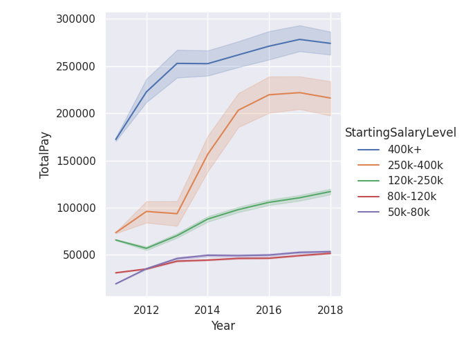
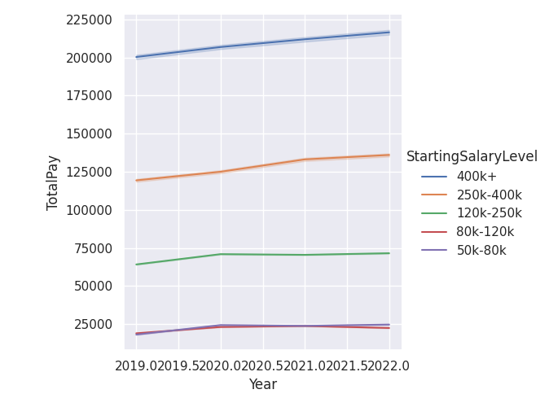

### estimated ucla salary progression, categorized by starting salary range ( job title seems to have changed during 2019, thus am plotting one starting from 2011, and one starting 2019 ).






### notes:

```

docker run -it -u $(id -u):$(id -g) -w $PWD -v /mnt:/mnt  pangyuteng/ml:latest bash

python run.py

data downloaded from 
https://transparentcalifornia.com

```